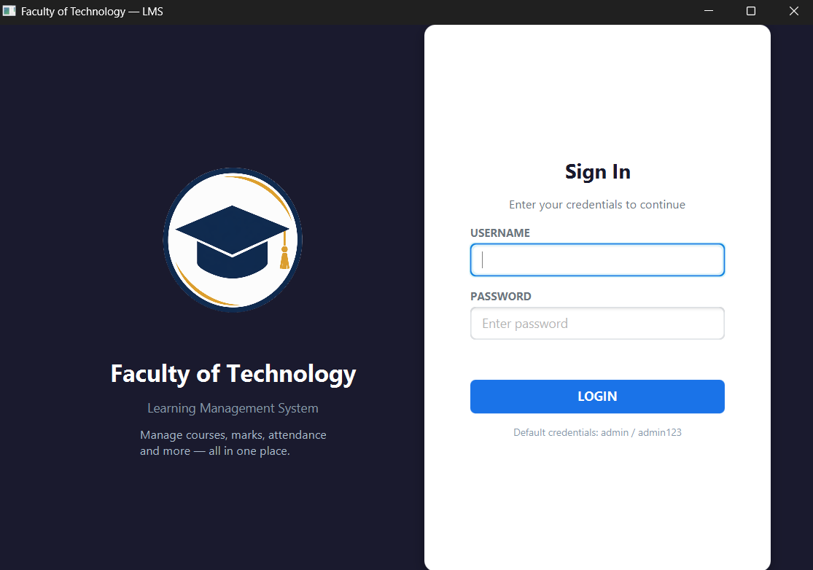
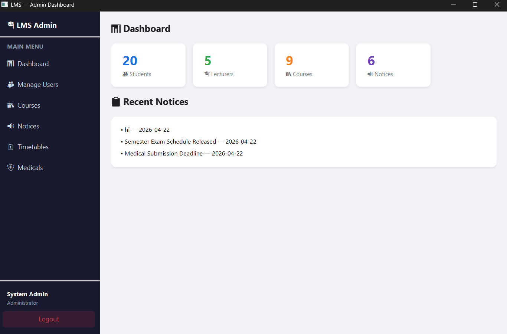
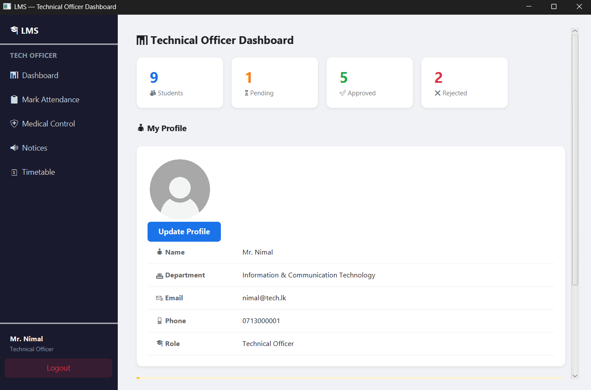
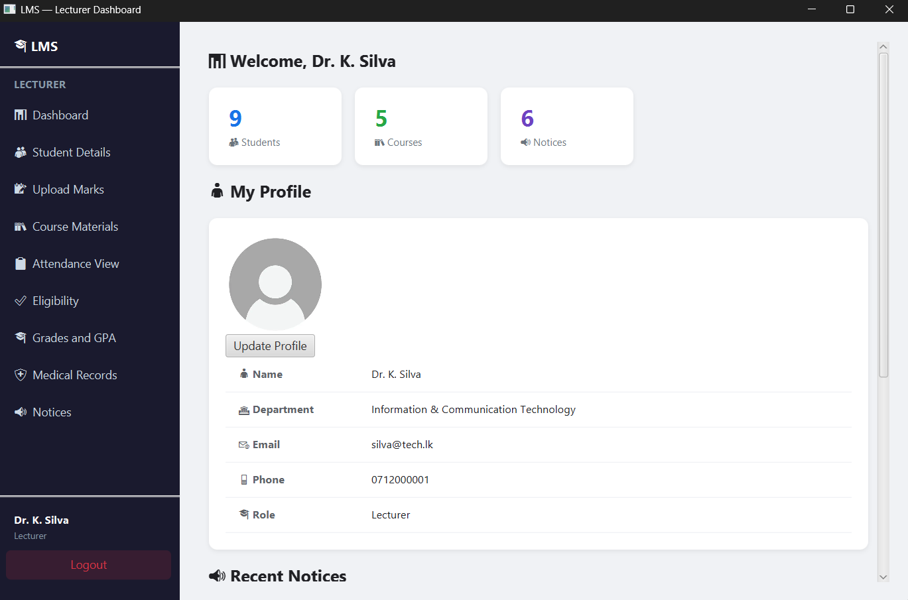
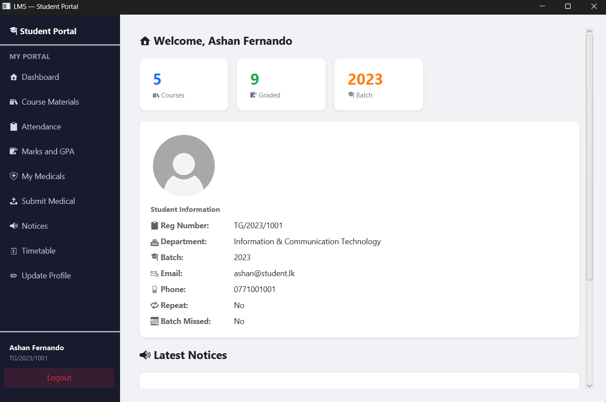

# 📚 Faculty of Technology LMS

A **Learning Management System (LMS)** developed using **Java, JavaFX, and MySQL** for managing academic activities in a university environment.

---

## 🚀 Features

### 👨‍💼 Admin Panel
- Manage Students, Lecturers, and Technical Officers  
- Manage Courses  
- Publish Notices  
- View system dashboard  

### 👨‍🏫 Lecturer Panel
- View student details  
- Upload marks  
- Manage course materials  
- Check attendance & eligibility  
- View medical records  

### 🛠 Technical Officer Panel
- Mark student attendance  
- Approve / Reject medicals  
- Manage notices  
- View timetable  

### 🎓 Student Portal
- View course materials  
- Check attendance  
- View marks & GPA  
- Submit medicals  
- View timetable  

---

## 🖥️ System Interfaces

### 🔐 Login Page


---

### 👨‍💼 Admin Dashboard


---

### 🛠 Technical Officer Dashboard


---

### 👨‍🏫 Lecturer Dashboard


---

### 🎓 Student Portal


---

## 🛠 Technologies Used

- Java  
- JavaFX  
- MySQL  
- Maven  
- Scene Builder  

---

## ⚙️ Setup Instructions

1. Clone the repository  
```
git clone https://github.com/your-username/your-repo-name.git
```

2. Open project in IntelliJ IDEA  

3. Setup MySQL database  
- Import the provided `.sql` file  

4. Run the project  
```
mvn javafx:run
```

---

## 🔑 Default Login

```
Username: admin
Password: admin123
```

---

## 👥 Team Members

- [Indusara Adhikari](https://github.com/IndusaraAdhikari003)  
- [Pramoda Guruge](https://github.com/pramodaguruge)  
- [Sewwandi](https://github.com/Sewwandi2003)  
- [Nethmini](https://github.com/Nethmini2399)  

---

## 📌 Project Purpose

This system helps to **digitize academic management** by improving:

- Efficiency  
- Accuracy  
- Accessibility  

---

## ⭐ Note

This is a **university group mini project** developed for learning purposes.
